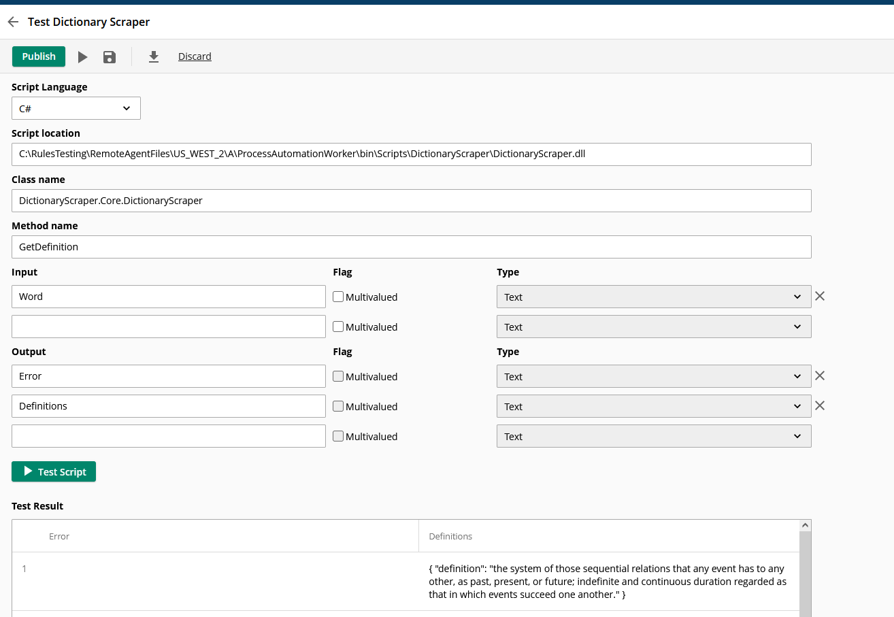
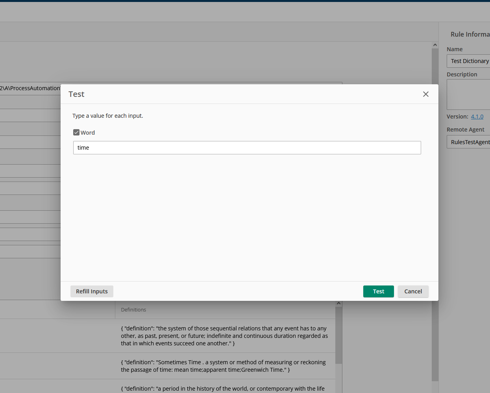
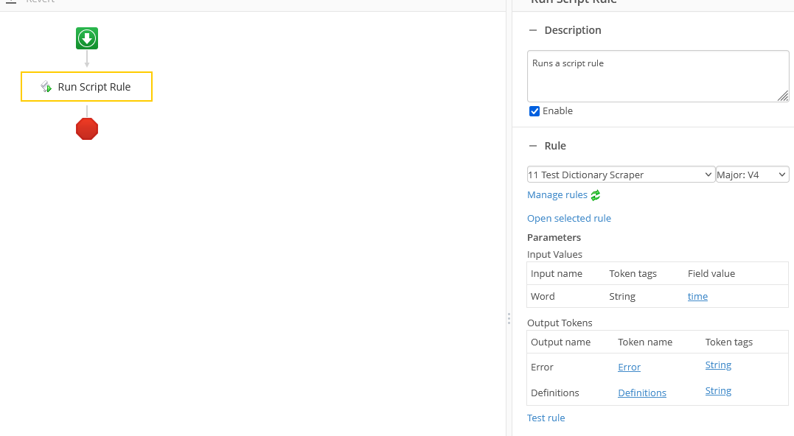

# Dictionary Scraper Laserfiche C# Rule script project

The script method invoked in this example is `DictionaryScraper.GetDefinition`

## Deploy script to your remote agent

- Copy the content of the build output folder `DictionaryScraper\bin\Debug\net48` folder under one of the three LFPALocalAgent folder e.g. `C:\RulesTesting\RemoteAgentFiles\US_WEST_2\A\ProcessAutomationWorker\bin\Scripts`

## Configure and test this script rule in your Laserfiche Cloud Account -> Process Automation -> Rules

- Create a new Script rule
  - Script location: `ProcessAutomationWorker\bin\Scripts\DictionaryScraper\DictionaryScraper.dll`
  - Class name: `DictionaryScraper.Core.DictionaryScraper`
  - Method name: `GetDefinition`
  - Output
    - `Definitions` The result *key* name in the outputs Dictionary
    - `Error` The error *key* name in the outputs Dictionary

  

## Test the rule

- Providing test word you want to search in dictioanry.com, e.g. `time`

## Test script rule in a workflow

- Run the workflow and verify `Definitions` token contains expected result

