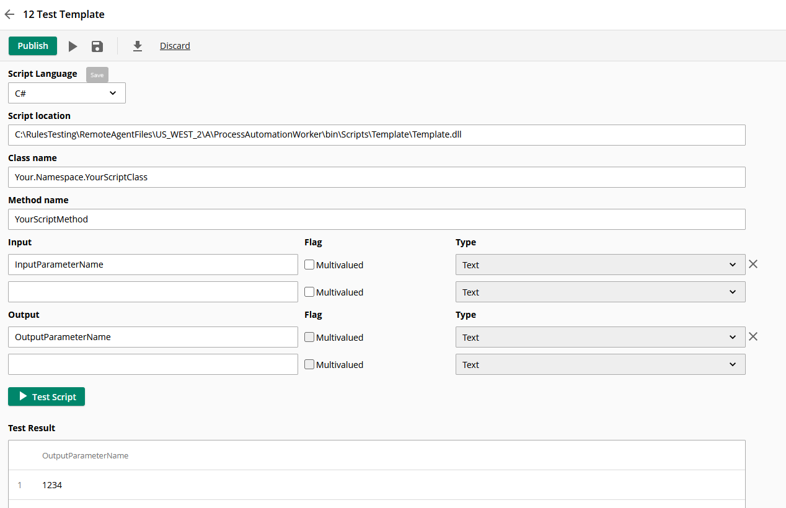
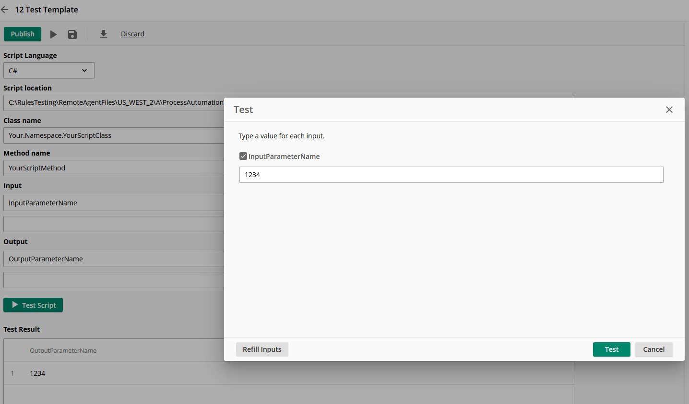
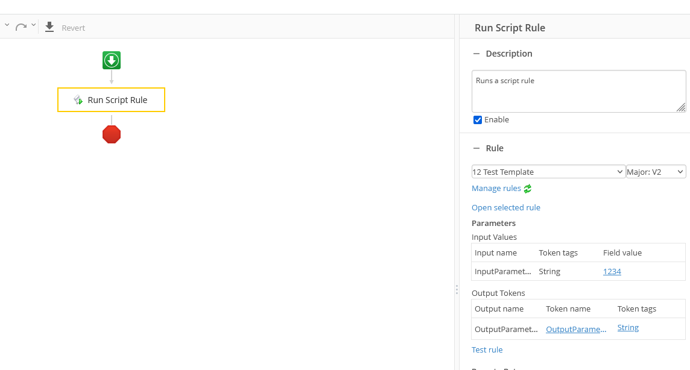

# Laserfiche C# Rule script Template project

The script method invoked in this example is `YourScriptClass.YourScriptMethod`

## Deploy script to your remote agent

- Copy the content of the build output folder `Template\bin\Debug\net48` folder under one of the three LFPALocalAgent folder e.g. `C:\RulesTesting\RemoteAgentFiles\US_WEST_2\A\ProcessAutomationWorker\bin\Scripts`

## Configure and test this script rule in your Laserfiche Cloud Account -> Process Automation -> Rules

- Create a new Script rule
  - Script location: `ProcessAutomationWorker\bin\Scripts\Template\Template.dll`
  - Class name: `Your.Namespace.YourScriptClass`
  - Method name: `YourScriptMethod`
  - Input: `InputParameterName`
  - Output: `OutputParameterName`

  

## Test the rule

- Providing a string input, this script would echo the input, e.g. `1234`

## Test script rule in a workflow

- Run the workflow and verify `Definitions` token contains expected result

